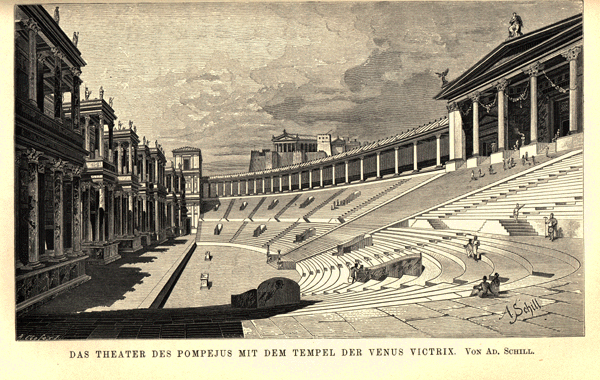
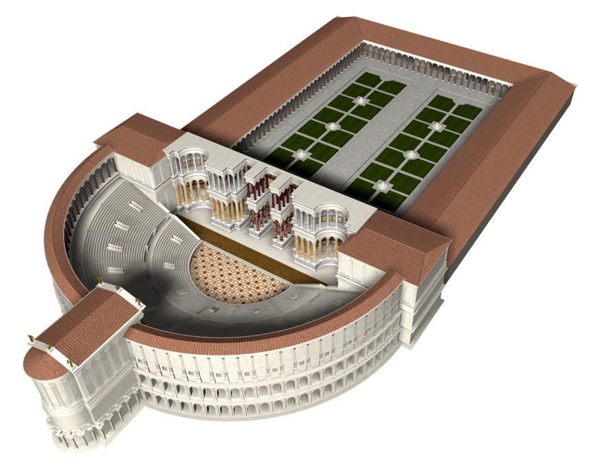
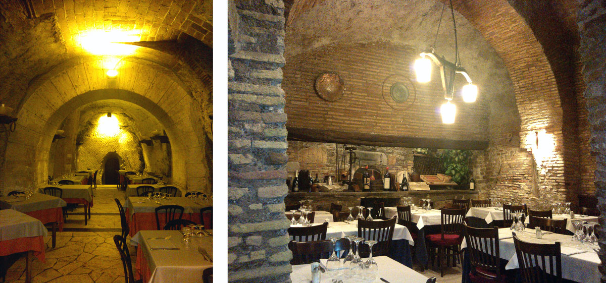

Costruito nel Campo Marzio tra il 61 e il 55 a.C. ad imitazione del teatro di Mitilene che Pompeo aveva visitato, il Teatro di Pompeo fu il primo teatro in pietra edificato sul suolo di Roma e risolutamente voluto e finanziato da Gneo Pompeo, un console e generale romano nel pieno di una brillante carriera politica e militare.

“_Gli piacque il teatro di Mitilene; ne fece fare degli schizzi e la pianta con l’intenzione di costruirne uno uguale a Roma, seppure più grande e fastoso._"[^1]

Pompeo, ormai potente e ricchissimo, riuscì ad aggirare la legge del Senato - che in realtà non poteva opporsi a lui più di tanto - ricorrendo ad espedienti che salvassero almeno le apparenze, come quello di costruire il teatro in onore di Venere Vincitrice, fautrice divina delle sue vittorie militari.

Egli costruì il tempio dedicato a Venere Vincitrice _(Venus Victrix)_ sulla sommità di una gradinata che in pratica non era altro che una classica cavea semicircolare a ridosso di una scena monumentale larga ben 90 metri. Le scale di accesso al tempio, ovvero la cavea stessa, erano dunque diventate le gradinate del teatro sulle quali la gente assisteva agli spettacoli voltando le spalle proprio al luogo sacro che ne aveva legittimato la costruzione.

E per farlo Pompeo non badò a spese, anche se in verità l’opera era in massima parte finanziata col bottino di guerra. Ad ogni modo il primo teatro stabile dell’Urbe doveva essere il più imponente e meraviglioso di tutti i tempi: così è stato e Roma non perde l’occasione per autocelebrarsi o, se vogliamo, per _portare in scena se stessa!_.

La monumentalità di questo teatro, che i romani amavano soprattutto per le pregevoli decorazioni, vuole mostrare al mondo la grandezza e la potenza di Roma, proprio in un momento delicato ed importante che segna l’affermazione della nuova politica romana nel passaggio dalla _Res Publica_ al periodo imperiale che inizierà a breve con Ottaviano Augusto.

_Fig. 1.3 Ricostruzione del Teatro di Pompeo_

L’edificio aveva splendidi rivestimenti in pietra gabina alternata al travertino che creavano un piacevole contrasto di toni. Di fronte all'entrata erano situate due gigantesche statue di Dioscuri con cavalli. La cavea, del diametro di circa 150 metri ed organizzata su due ordini di gradinate, era costituita da una doppia serie di muri radiali collegati tra loro da strutture curvilinee che formavano cunei coperti da volte a botteche avevano il compito di sostenere gradinate di eccezionale ampiezza e che potevano ospitare oltre 25.000 persone.

Il fronte scena (_scaenae frons_) era articolatissimo e formato da tre esedre colonnate, delle quali la centrale era rettangolare mentre le due laterali erano semicircolari.

_Fig. 2.3 Ricostruzione del Teatro di Pompeo_

Dietro il palcoscenico si apriva un immenso portico con colonne di granito, enormi statue delle nazioni sottomesse da Pompeo e una zona aperta con fontane, giardini, ninfei e due boschetti di platani. Il quadriportico, dove ci si poteva riparare in caso di pioggia, terminava con la Curia di Pompeo per le periodiche riunioni del Senato, dominata da una sua grande statua che tiene un globo nella mano destra; qui Cesare fu pugnalato e ucciso, proprio ai piedi della statua monumentale di Pompeo.

Viste e considerate le dimensioni insomma, il complesso proponeva quella che oggi definiamo come _riqualificazione urbana_, cioè un vero e proprio riassetto urbanistico dell’area che sposava il sacro col profano sotto l’alto patrocinio del senato romano.

E ancora oggi è sorprendente individuare l’andamento curvilineo della cavea perfettamente leggibile nonostante le successive edificazioni: la curva interna è in quel semicerchio descritto dalle case di piazza dei Satiri e di via di Grottapinta, mentre quella esterna si può osservare nell’andamento di via del Biscione e di piazza Pollaiola.

_Fig. 3.3 Teatro di Pompeo_

Purtroppo di questo primo teatro in pietra dell’Urbe poco o nulla ci rimane.

“Benché Augusto avesse fatto murare la Curia come _locus sceleratus_ (luogo maledetto) a causa dell'assassinio di Cesare, lasciò in uso il teatro che venne restaurato dagli imperatori successivi fino al V sec. d.C. Al tempo del re goto Teodorico, un suo cancelliere romano ricordava con ammirazione il Teatro di Pompeo, per i suoi marmi, le sculture e gli affreschi, con “_caverne coperte a volta con pietre pendenti collegate in forme bellissime_”.

_Ma nel medioevo divenne cava di marmi e materiali edilizi, usato poi come fondamenta per nuovi edifici_[^2].

E così quello che rimane di questo incredibile teatro sono solo le imponenti sostruzioni che attualmente ospitano ristoranti ed esercizi commerciali nella parte bassa, alberghi e abitazioni in quella superiore: purtroppo null’altro è rimasto dell’edificio originario.

_Fig. 3.3 Sostruzioni del Teatro di Pompeo_

[^1]: Plutarco, _Vita di Pompeo_.
[^2]: [[www.romanoimpero.com](http://www.romanoimpero.com/)].