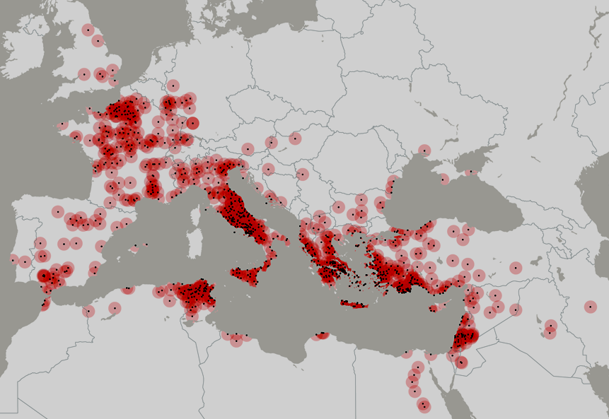

L’acustica degli antichi teatri greci e romani è sempre stata oggetto di notevole interesse da parte di storici, archeologi, filosofi e studiosi di teatro, interesse ampiamente testimoniato dai numerosi scritti di ogni epoca dedicati all’argomento.

Tra le numerose ricerche specifiche è il caso di menzionare un interessante progetto di ricerca europeo di alcuni anni fa denominato [ERATO](https://cordis.europa.eu/project/id/ICA3-CT-2002-10031) (_Identification, Evaluation and Revival of the Acoustical heritage of ancient Theatres and Odea_), il Progetto di Ricerca italiano ATLAS (_Ancient Theatres Lighting and Acoustics Support_) e, tra quelle più recenti, risulta di particolare interesse un numero monografico della rivista _Acta Acustica united with Acustica_ (_Vol._  _99, Number 1, January/February, 2013_) che ha visto la partecipazione di numerosi studiosi ed enti universitari europei.

Finalità dei progetti è stata quella di archiviare una corposa serie di rilevamenti acustici eseguiti nei teatri greci e romani meglio conservati, impiegando strumenti diagnostici e tecniche di misura tra le più avanzate oggi disponibili; grazie a questa banca dati, sono state poi implementate numerose simulazioni, sia con modelli in scala sia con modelli matematici, allo scopo di indagare e comprendere il comportamento acustico originario di questi edifici.

Tuttavia ancora oggi, quando si affronta l’argomento, il nostro giudizio paga talvolta un tributo emotivo dovuto alla fascinazione che su di noi esercita il teatro antico ed in particolare quello greco che – almeno per noi occidentali – ha segnato l’inizio della drammaturgia e della messa in scena del pensiero e delle azioni umane: in una parola, il Teatro.

Per avere un’idea della capillare diffusione di questi teatri, possiamo riferirci al censimento – tuttora in corso – proposto dall’associazione culturale [Engramma](https://engramma.it), c/o IUAV di Venezia che propone un'indicizzazione degli antichi edifici teatrali greci e romani (teatri e _odeia_) del bacino del Mediterraneo e delle province dell'impero romano, documentati o noti attraverso fonti dirette e indirette.

Fig. 1.1 Teatri e odeon greci e romani, da [Engramma, Censimento dei Teatri e Odeia greci e romani](http://www.engramma.it/eOS/index.php?id_articolo=385)