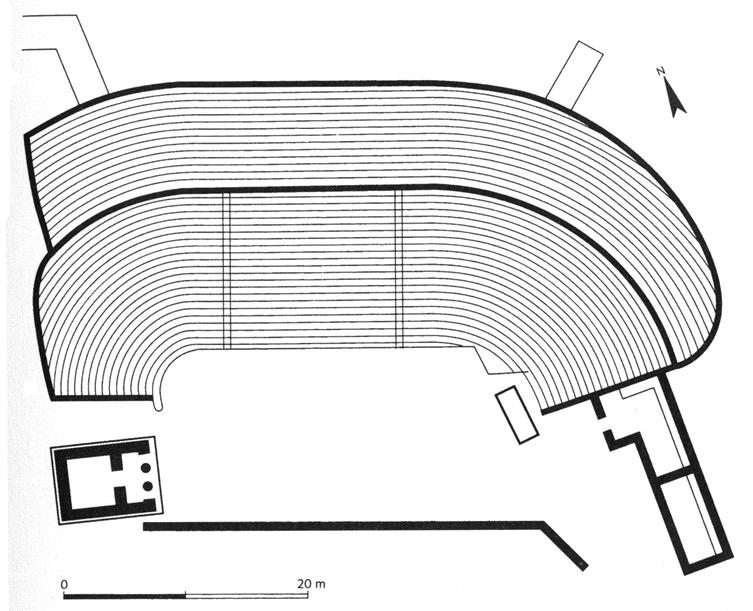
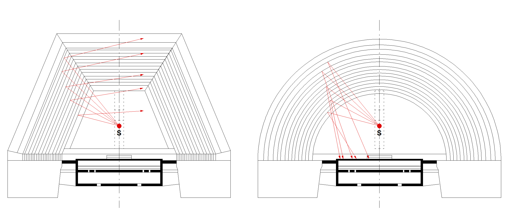

I primi edifici teatrali del mondo greco che conosciamo erano strutture in legno ed avevano una forma trapezoidale – in diversi casi anche rettangolare – che circondava il luogo della danza chiamato “orchestra” (dal verbo _orchéomai_, danzare) mentre la forma della cavea (_théatron_) e la relativa disposizione del pubblico, erano certamente definite dalle naturali linee visuali ed acustiche, tracciate per accomodare gli spettatori in posizioni ravvicinate all’azione.

In alcune zone periferiche dell’Attica sono stati rinvenuti resti di teatri che presentano un’orchestra rettangolare o trapezoidale, il più antico dei quali è il teatro di Thorikos, antecedente il V° secolo a.C.

Si tratta di una struttura in pietra inizialmente non progettata per le rappresentazioni sceniche ma impiegata come luogo di riunione cittadina[^1] e solo successivamente adattata a teatro grazie allo sviluppo delle rappresentazioni teatrali anche fuori dalla città di Atene.

Fig. 1.2 Pianta del teatro di Thorikos[^2]

Non abbiamo molte informazioni riguardo queste strutture – che per noi hanno solo una valenza storica – tuttavia abbiamo notizie di alcuni crolli che hanno reso necessaria la costruzione dei teatri in pietra che conosciamo oggi; pare infatti che durante un agone tragico che vedeva concorrere tra gli altri anche Eschilo, le tribune in legno del primo Teatro di Dioniso (ma secondo alcuni si trattava dell’agorà di Atene adibita a spazio teatrale) siano crollate causando molte vittime.

Alcuni archeologi[^3] sono concordi nel ritenere che il successivo sviluppo della forma semicircolare sia stata dettata da ragioni acustiche e visuali, probabilmente confortate dalle teorie di Pitagora, Democrito e Aristotele circa la propagazione del suono per anelli concentrici ed hanno accertato, sebbene con pareri discordanti, che anche il Teatro di Dioniso ad Atene, quello di Damocopo a Siracusa, quello di Magnesia e quello di Catania, sono stati in seguito modificati in tal senso.

Tuttavia l’affermazione della forma semicircolare è forse dovuta anche a considerazioni di tipo diverso come l’intrinseca plasticità architettonica della forma curvilinea - forse ritenuta compiuta e formalmente perfetta - l’equidistanza degli spettatori, l’eliminazione degli angoli morti dovuti alle intersezioni delle parti rettilinee e infine alle teorie riguardo la propagazione del suono.

Per quanto riguarda le linee di vista si potrebbe dissertare sulla supremazia dell’una forma sull’altra se poniamo come condizione la centralità dell’orchestra ove inizialmente agivano gli attori in questi teatri, una situazione ben diversa rispetto all’azione sul palcoscenico della tragedia del successivo periodo “classico”.

Riguardo i vantaggi acustici è singolare osservare che proprio nel teatro trapezoidale, quello ad ali divergenti rispetto alla scena come ad esempio l’antico teatro greco di Damocopo a Siracusa (476 a.C.), le riflessioni sonore risultano meglio equilibrate rispetto a quelle del teatro a pianta semicircolare perché sono tutte indirizzate in favore degli spettatori, proprio come in una moderna sala da concerto cosiddetta “a ventaglio rovesciato”.

La figura 1.2 compara in modo molto schematico l’andamento delle riflessioni generate da una sorgente sonora collocata all’interno dell’orchestra: nella pianta trapezoidale (una ricostruzione dell’antico teatro di Damocopo a Siracusa) tutte le riflessioni laterali prodotte dalle alzate dei gradini sono orientate in favore degli spettatori e non tornano indietro verso la sorgente di emissione mentre una generica pianta semicircolare produce riflessioni molto ritardate che, sommandosi a quelle della scena, innescano fenomeni di eco che compromettono l’intelligibilità del segnale.

Fig. 2.2 Pianta trapezoidale e semicircolare

Tuttavia la forma semicircolare prenderà il sopravvento e con i successivi teatri in pietra, divenuti stabili e sicuri, si avvia il rapido sviluppo sia dell’edificio teatrale sia della scrittura di scena che giungerà alla completa maturità con drammaturghi come Eschilo, Sofocle ed Euripide.

Siamo intorno al V secolo a.C. ed è proprio in questo periodo che il teatro greco si perfeziona: l’antica “capanna” degli attori diventa una scena su due piani (_skené_), realizzata in legno e talvolta in pietra, che propone il contesto urbano come un tempio o un palazzo. Il palcoscenico in legno (_logeion_) viene sopraelevato e si estende spesso oltre le estremità dell’orchestra.

La parte superiore della scena (_episkenion_) ospita le “macchine” per gli effetti scenici: piattaforme girevoli (_ekkuklema_), gru e carrucole per sollevare gli attori (_mechané_) ed anche le macchine per gli effetti sonori come la “macchina dei tuoni” (_brontèion_).

«Ho davvero paura, macchinista, fa' attenzione!» dice Trigeo prima di librarsi in aria sollevato dalla _mechané_ nella _Pace_ di Aristofane.

Il teatro greco dell’età classica è così compiuto e _“nel momento in cui la_ _skené_ _divenne una costruzione elaborata, la regola convenzionale del palazzo per la tragedia si affermò pienamente e così si trasmise come forma da imitare agli autori drammatici del Rinascimento”_[^4].

La figura 1.3 mostra la ricostruzione ipotetica del Teatro di Dioniso di Atene come poteva apparire nel V secolo a.C. ai tempi di Pericle. Il disegno è stato ricavato sulla base della ricostruzione di H. C. Baldry (_Le théâtre tragique des Grecs_), Paul Demont e Anne Lebeau (_Introduction au théâtre grec antique_).

Situato presso l'acropoli di Atene, fu il teatro più importante del mondo greco nel V e IV secolo a.C. e venne utilizzato dai più importanti autori greci (Eschilo, Sofocle ed Euripide per la tragedia, Aristofane e Menandro per la commedia) per mettere in scena le loro opere.

")
Fig 3.2 Teatro di Dioniso nel V secolo a. C., Atene (ricostruzione ipotetica)

Anche il teatro di Epidauro nel Peloponneso, benché ellenistico e successivo a quello di Dioniso, mostra il tipico "schema greco" che sfrutta il pendio del terreno collinare, un disegno della cavea che supera il semicerchio e l’orchestra perfettamente circolare.

")
Fig 4.2 Teatro di Epidauro (foto di Andreas Trepte)

In seguito quasi tutti i principali teatri greci ed ellenistici furono modificati dai romani, generalmente costruendo una scena imponente, ampliando la cavea e riducendo l’orchestra ad un semicerchio, solitamente lastricato in pietra.

Nel caso di Epidauro tuttavia, l’orchestra originale in terra battuta non è stata modificata mentre è ben leggibile l’ampliamento della cavea nella divisione creata dall’unico corridoio anulare presente (diázoma).

Alle 34 file di gradini della cavea originaria che ospitava 6200 spettatori, nel II sec. a.C. i romani ne aggiunsero altre 21 per un totale di 55 per una capienza complessiva di circa 14.000 persone.

Fig 5.2 Teatro di Epidauro, in evidenza l'ampliamento romano della cavea

[^1]: H. Bulle _(NdC: mancano ulteriori riferimenti)_.
[^2]: M. Bieber,_The History of the Greek and Roman Theater_.
[^3]: C. Anti et al. _(NdC: mancano ulteriori riferimenti)_. 
[^4]: A. Nicoll, _Lo spazio scenico_.