Il teatro di Epidauro nel Peloponneso, considerato il “Teatro Greco” per eccellenza, rappresenta un caso di studio emblematico sia per l’indiscutibile rilevanza storiografica sia per la fascinazione che da sempre esercita su di noi.

Costruito presumibilmente da Policleto di Argo (detto anche il Giovane) nel 350-360 a.C. questo teatro è il più frequentato da studiosi e appassionati di tutto il mondo: le dimensioni, l’armonia architettonica e l’ottimo stato di conservazione ne fanno indubbiamente un punto di riferimento assoluto.

Molto si è detto e ancor di più si è scritto riguardo la perfezione e la meravigliosa acustica di questo teatro, affermazione che però occorre _leggere_ nel contesto in cui si agiva il teatro di allora.

La valutazione dei teatri antichi infatti, è generalmente limitata ai soli descrittori acustici convenzionali, definiti negli ultimi decenni e ricavati sperimentalmente all’interno di spazi confinati: sappiamo infatti che elevati indici come la chiarezza musicale o l’intelligibilità della parola non sono sempre sinonimi di “buona resa acustica”, almeno così come la intendiamo oggi, e che a teatro occupato ci troviamo essenzialmente in condizioni di _campo libero_[^1].

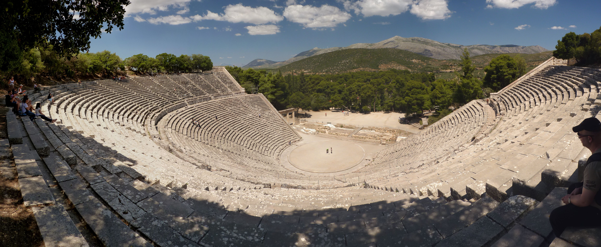

_Fig. 1.4 Teatro di Epidauro, foto di Ronny Siegel_

Un elemento fondamentale per l’acustica di Epidauro ed in particolare per l’intelligibilità della parola, era certamente costituito dalle favorevoli condizioni ambientali al contorno dove, salvo il maltempo o un forte vento, era assicurato un basso rumore residuo (o di fondo), condizione oggi assolutamente impensabile per la nostra società meccanizzata: chi ha visitato l’acropoli di Atene, il Teatro di Dioniso o quello di Erode Attico, sa cosa questo significhi!

E ancora oggi, Epidauro rimane uno dei più silenziosi teatri antichi della Grecia, con un rumore di fondo medio di 39 dB(A)[^2].

Visitando Epidauro la prima cosa che colpisce è la silenziosità e la sacralità del luogo, fatte salve naturalmente le “prove acustiche” dei visitatori, talvolta davvero singolari!

Chiunque abbia visitato Epidauro avrà senz’altro sentito o sperimentato personalmente l’effetto della ripetizione del segnale originato da un semplice battito di mani e percepito chiaramente come un’eco ribattuta e prolungata nel tempo. Questa infatti è la seconda cosa che normalmente si fa: si battono le mani, si stropiccia della carta o si lascia cadere una monetina esattamente al centro dell’orchestra per sentire e far sentire agli amici l’effetto che fa; ma si può anche cantare, esplodere un palloncino o un petardo per registrarne la risposta all’impulso.

Bene, ma cosa succede esattamente quando facciamo queste prove?

##### MISURE ACUSTICHE

Sollecitando il teatro dal centro dell’orchestra con un colpo impulsivo come può esserlo un singolo e deciso battito di mani, inneschiamo una serie di riflessioni generate dai gradini della cavea che rinviano l’energia sonora in direzione della sorgente di emissione (S), più o meno come mostrato molto schematicamente nella figura 2.4 (sinistra).

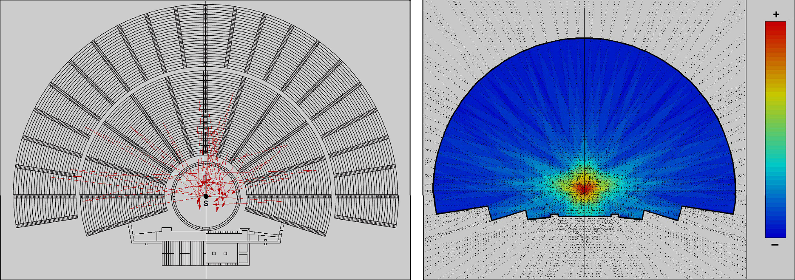

_Fig. 2.4 Teatro di Epidauro, riflessioni schematiche sorgente/ricevitore posizionato al centro dell'orchestra_

Quello che otteniamo è una visibile concentrazione (focalizzazione) dell’energia sonora in un punto preciso che possiamo visualizzare anche tramite una semplice modellazione come mostrato nella figura 2.4 (destra); non si tratta di una simulazione acustica puntuale del teatro, ma di un semplice studio sulla sua forma geometrica effettuato ipotizzando superfici riflettenti ed il teatro senza spettatori. Il risultato è analogo a quello della figura accanto dove le riflessioni sono tracciate geometricamente, con la differenza che qui possiamo visualizzarne l’intensità relativa ed osservarne la focalizzazione, situata esattamente al centro dell’orchestra. 

Il fenomeno è facilmente riscontrabile in qualunque struttura all’aperto dotata di un’ampia gradinata in pietra o nei grandi edifici con la copertura voltata come molte delle nostre chiese: in queste strutture infatti le riflessioni producono concentrazioni energetiche chiamate “fuochi acustici”, corrispondenti ai “fuochi geometrici” del disegno architettonico.

Ma contrariamente agli edifici confinati, dove percepiamo il fenomeno come una riverberazione omogenea e prolungata per via della consistente densità delle riflessioni, nei teatri all’aperto come ad Epidauro sentiamo una successione di echi ben distinti e ravvicinati, il cui effetto è dovuto alla distanza tra la sorgente sonora ed i gradini che, essendo variabile, produce tempi di arrivo altrettanto diversi e temporalmente spaziati.

E insieme alle riflessioni abbiamo il fenomeno del _back-scattering_ (retro diffusione o dispersione) cioè un’interferenza acustica generata dalle diffrazioni che si generano tra un gradino e quello successivo, i cui spigoli sono assimilabili ad altrettante sorgenti virtuali di onde sferiche che re-irradiano energia quando incontrano una superficie acusticamente riflettente come la pietra.

Tale effetto, che possiamo considerare come una corposa serie di prime riflessioni che giungono dalle spalle dell’ascoltatore, produce una dispersione del suono molto accentuata che prolunga in maniera rilevante la coda riverberante del teatro.

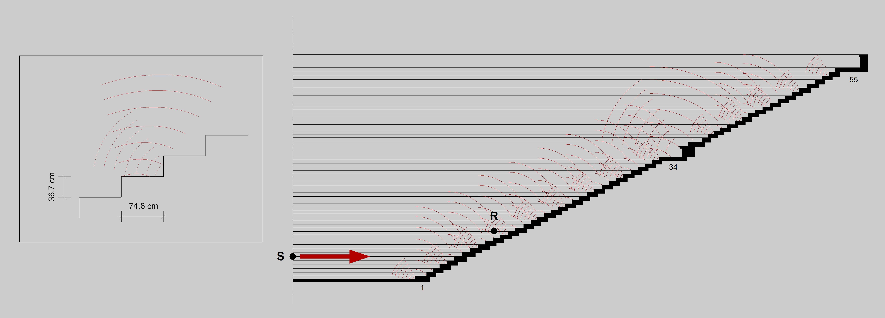

_Fig. 3.4 Schema semplificato del back-scattering generato dai gradini della cavea_

Il fenomeno del _back-scattering_ è stato ampiamente studiato da diversi autori[^3],[^4],[^5] sia mediante modelli matematici sia con misurazioni in situ convenendo che l’acustica del teatro di Epidauro è il risultato dell’integrazione del suono diretto con la riflessione della pavimentazione dell’orchestra e con la retro-diffusione generata dai gradini della cavea.

##### RISPOSTA ALL’IMPULSO

L’analisi che segue si riferisce ad una singola misura impulsiva registrata ad Epidauro a teatro vuoto impiegando un petardo come sorgente sonora, un microfono omnidirezionale ed un registratore digitale per il salvataggio dell’evento; la misura è stata eseguita dal Prof. Angelo Farina (e collaboratori) ed è pubblicamente disponibile sul web all'URL [http://www.youtube.com/watch?feature=player_embedded&v=OSoYEP5NRAs](http://www.youtube.com/watch?feature=player_embedded&v=OSoYEP5NRAs).

<iframe width="560" height="315" src="https://www.youtube-nocookie.com/embed/OSoYEP5NRAs" title="YouTube video player" frameborder="0" allow="accelerometer; autoplay; clipboard-write; encrypted-media; gyroscope; picture-in-picture" allowfullscreen></iframe>

La posizione della sorgente sonora (S) e del ricevitore (R) sono indicate nella figura 3.5 di sinistra, mentre a destra è mostrata la risposta all’impulso realmente misurata nelle posizioni indicate e oggetto della presente analisi. Si nota un impulso molto ricco di riflessioni e piuttosto prolungato nel tempo che determina una riverberazione relativamente lunga per un teatro all’aperto e privo della scena come questo.

, ricevitore (R) e risposta all'impulso misurata")

_Fig. 4.4 Sorgente (S), ricevitore (R) e risposta all'impulso misurata_

La seguente figura 3.6 visualizza la medesima risposta impulsiva (pressione al quadrato) dei primi 100 metri di percorrenza del suono dove si osserva che le riflessioni successive dei gradini che generano l’eco ribattuto che sentiamo, non hanno un decadimento omogeneo, ovvero lineare e gradualmente smorzato nel tempo, ma presentano dei visibili avvallamenti e rigonfiamenti come se il segnale fosse in qualche modo “modulato” in ampiezza a causa delle interferenze acustiche in gioco.

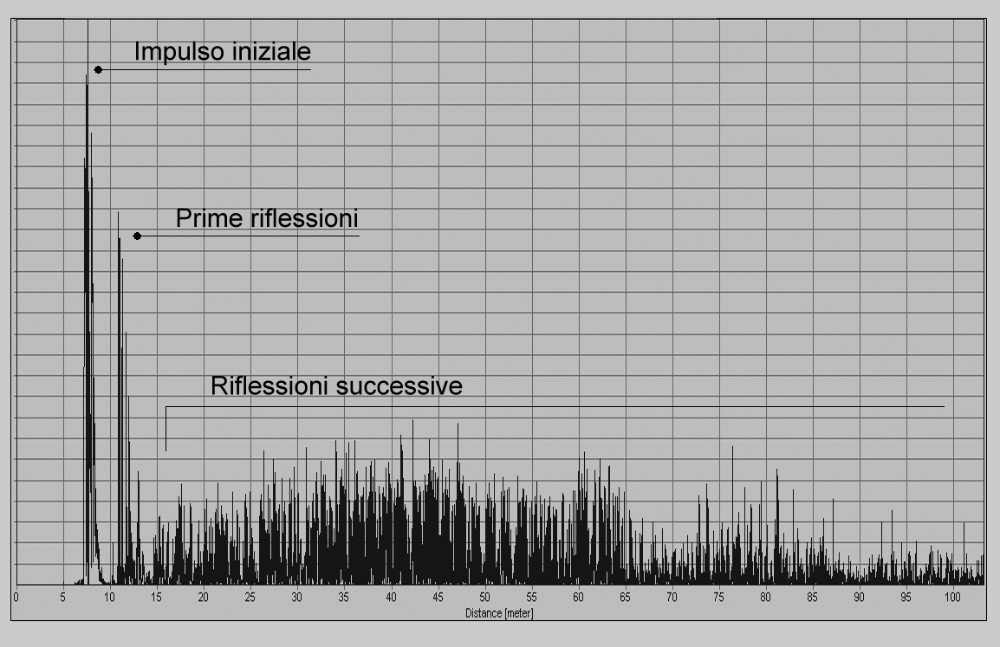

_Fig. 5.4 Risposta all'impulso: analisi dei primi 100 m di percorrenza del suono_

##### ANALISI SPETTRALE

L’analisi tridimensionale della risposta all’impulso mette in luce l’effetto della diffrazione, mostrando vistosi avvallamenti e picchi in alcune regioni frequenziali che ci permettono di evidenziare le componenti più significative dello spettro nonché la loro frequenza approssimativa. Osserviamo che l’energia in bassa frequenza si disperde piuttosto rapidamente perché il teatro non dispone di superfici di dimensioni utili per riflettere tali frequenze e gli ostacoli rappresentati dai gradini della cavea sono piccoli rispetto a queste lunghezze d’onda.

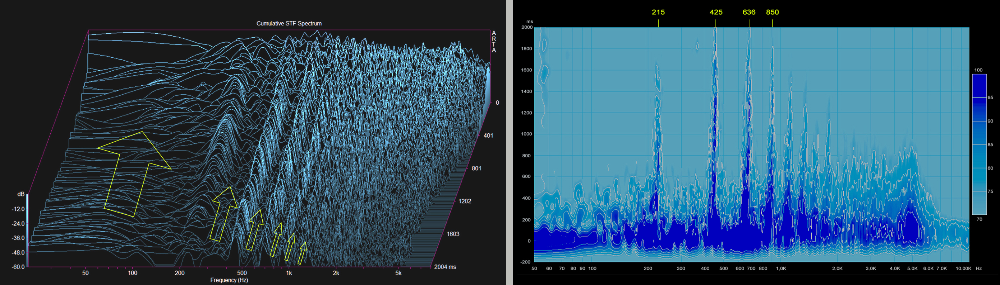

_Fig. 6.4 Risposta all'impulso: spettro cumulativo_

Pertanto il massimo effetto della diffrazione si ha nelle frequenze medie, da circa 215 Hz in avanti, dove si verifica un rinforzo selettivo del suono determinato dalle dimensioni e dalla proporzionalità dei gradini, molto prossima al rapporto di 2:1.

Alcuni anni orsono questo fenomeno, chiamato _filtraggio del suono_, è stato notato da altri ricercatori rilevando che la dispersione del suono (_scattering_) agisce in qualche modo come un filtro passa-alto da circa 500 Hz in avanti privilegiando componenti spettrali in relazione armonica tra loro[^6]. Tuttavia si potrebbe forse definire questo fenomeno come un rinforzo di particolari frequenze, piuttosto che un vero e proprio filtraggio sonoro.

##### ANALISI ARMONICA

Ma osservando lo spettro con maggiore attenzione, si individuano altre singolari proprietà che possono suggerire stimolanti chiavi di lettura. Nella figura 7.4 di sinistra possiamo vedere che lo spettro è costituito da bande frequenziali che sono in stretta relazione armonica tra loro e dove possiamo identificare con facilità la fondamentale, la seconda, la terza, la quarta armonica etc., che possiamo trascrivere con buona approssimazione in notazione musicale (figura 7.4 di destra).

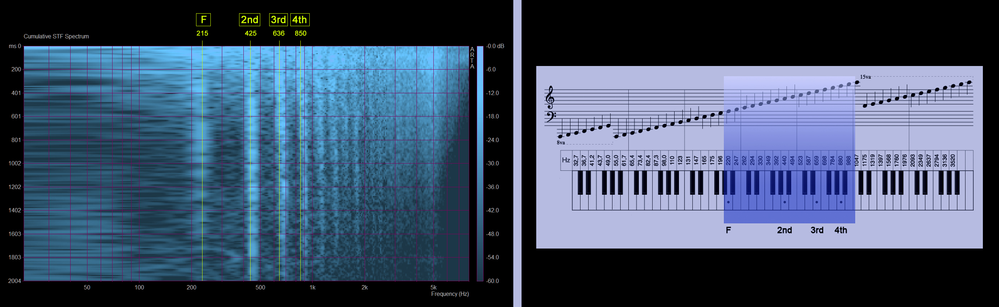

_Fig. 7.4 Analisi spettrale e relazioni armoniche_

Ne risulta che lo spettro del teatro di Epidauro sembrerebbe accordato sul sistema diatonico teorizzato da Pitagora circa due secoli prima della costruzione del teatro. Questo sistema, basato sulla fondamentale relazione tra ottava e quinta giusta, è stato poi elaborato e classificato dal compositore e filosofo di prima formazione pitagorica e poi aristotelica Aristosseno da Taranto, suddividendo la musica greca per generi (diatonico, cromatico, enarmonico) ed informandoci che proprio il diatonico era il genere più antico e diffuso del tempo perché considerato come il più rispondente alle esigenze della tradizione musicale greca, al gusto ed alle tendenze delle varie popolazioni formanti la grande nazione ellenica.

##### ANALISI DEL DECADIMENTO

È altresì interessante osservare che lo spettro del teatro si “costruisce” progressivamente nel tempo, da circa 200 ms in avanti, per manifestarsi con chiarezza a circa 800 ms. Nella figura 8.4 è visualizzata la risposta all’impulso sezionata in tracciati di 100 ms ciascuno.

A sinistra si nota che l’energia in bassa frequenza si smorza velocemente cedendo il passo alla formazione dello spettro che possiamo ritenere “compiuto” attorno a 800 ms, come si osserva nella figura di destra dove – per una migliore lettura del grafico – sono stati omessi alcuni tracciati intermedi.

Quest’analisi per noi ha un doppio interesse perché anticipa un’altra peculiarità del teatro di Epidauro che sarà oggetto del prossimo argomento, il _pitch shifting_ della risposta impulsiva.

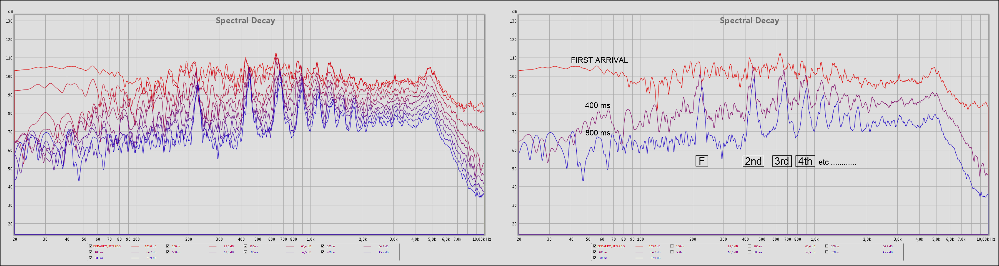

_Fig. 8.4 Composizione spettrale nel dominio del tempo_

##### ANALISI DEL PITCH SHIFTING

Un singolare aspetto del teatro di Epidauro non indagato in precedenza, è la variazione dell’impulso nel dominio di tempo/frequenza per effetto delle interazioni acustiche in gioco.

Sezionando la risposta impulsiva in frazioni di 100 ms ciascuna, ne possiamo osservare le modifiche spettrali.

Negli spettrogrammi della figura 3.9, che riportano i primi 800 ms dell’impulso, è indicata una linea a circa 425 Hz che corrisponde alla seconda armonica dello spettro analizzato in precedenza (Fig. 3.8) e che useremo come riferimento visivo per l’analisi.

A 100 ms la seconda armonica è perfettamente allineata a 425 Hz mentre, a 200 ms, si muove verso destra e vi rimane sino a 300 ms; a 400 ms tende a ritornare nella posizione iniziale mentre, a 500 ms, si muove di nuovo verso destra dove si stabilizza sino al decadimento naturale dell’energia.

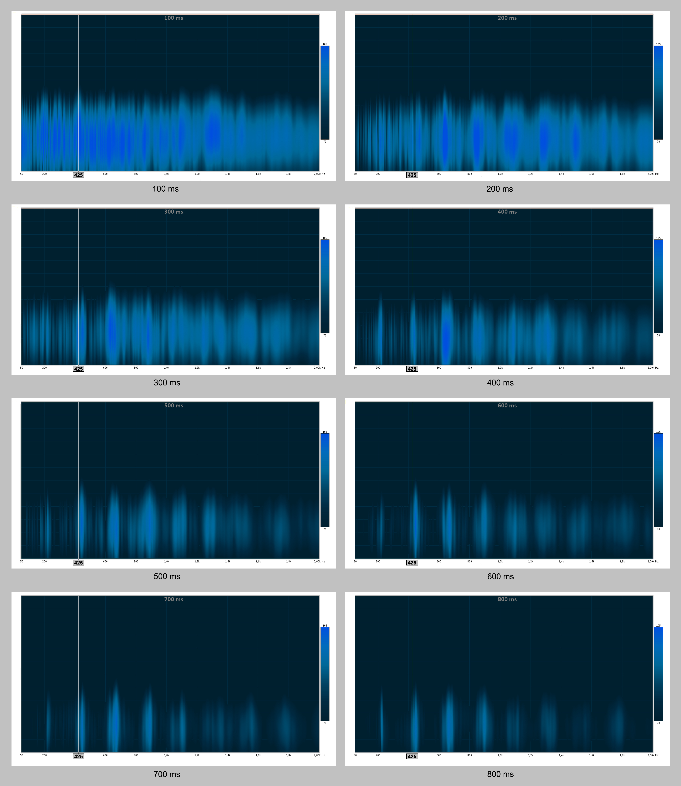

_Fig. 9.4 Risposta all'impulso sezionata a passi di 100 Ms ciascuno_

Lo spettro della risposta impulsiva mostra quindi un’evidente transizione che possiamo meglio visualizzare in questo modo:

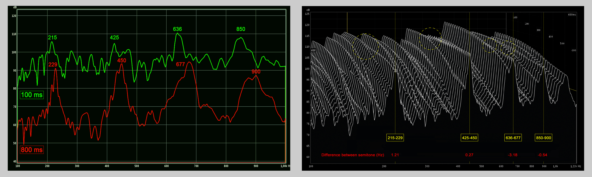

_Fig. 10.4 Risposta all'impulso: transizioni spettrali da 100 A 800 Ms_

La figura 10.4 di sinistra mostra lo slittamento frequenziale nel tempo compreso tra 100 e 800 ms, ovvero quando lo spettro è ormai stabilizzato. Si nota che, oltre al riferimento impiegato in precedenza a 425 Hz, anche le altre componenti armoniche si spostano verso destra generando un udibile cambiamento di tono.

La figura 10.4 di destra evidenzia invece il momento esatto della transizione temporale (cerchietti gialli) dove si osserva il movimento dello spettro verso il semitono superiore.

Si noti infine il singolare livello di accuratezza (in rosso) che indica la differenza in Hz tra i due semitoni contigui, calcolata mediante la relazione _f =_ _12__√2_. Transizione che possiamo trascrivere con buona approssimazione in questo modo:

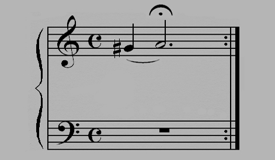

_Fig. 11.4 Teatro di Epidauro: pitch shifting crescente._

Il _pitch shifting_ si percepisce come una sorta di _effetto Doppler_ che, in particolari condizioni, può avere una traslazione inversa, ovvero con la frequenza che aumenta più o meno gradualmente anziché diminuire, esattamente come nel caso di Epidauro che mostra un vero e proprio cambio d’intonazione.

La comprensione di questo fenomeno, assimilabile al reticolo di diffrazione ottico, è ancora oggetto di studio e non è compiutamente prevedibile con gli attuali modelli matematici di simulazione, almeno per quanto riguarda la perfetta riproducibilità audio dello _shift_ frequenziale.

Diversi sono infatti i parametri coinvolti nella sua formazione, sostanzialmente riconducibili all’interazione complessa tra diffrazione e riflessione del suono. Sappiamo tuttavia che la percezione dello _shift_, la sua frequenza ed evoluzione nel tempo, dipendono anche dalla geometria e dalla periodicità degli ostacoli, dalle singole riflessioni che creano diversi tempi di ritardo, nonché dalla posizione della sorgente e del ricevitore che influenza notevolmente la maggiore o minore percezione dell’evento[^7].

##### IL SISTEMA MUSICALE GRECO

_Lo schema generale elaborato da Aristosseno, il cosiddetto "gran sistema perfetto" o Sistema Tèleion_ (vedi fig. 12.4) _era formato da quattro tetracordi congiunti due a due e terminanti, in basso, con una nota aggiunta (proslambanòmenos) la quale, risuonando all'ottava bassa della nota centrale, dava completezza e perfezione al sistema. Tale disposizione di suoni, che dava al tetracordo ellenico uno speciale carattere e attribuiva alla discesa del penultimo suono sull'ultimo quasi il significato di una sensibile discendente alla tonica, fu il nucleo fondamentale da cui sorse, poi, tutto il sistema musicale nazionale ellenico_[^8].

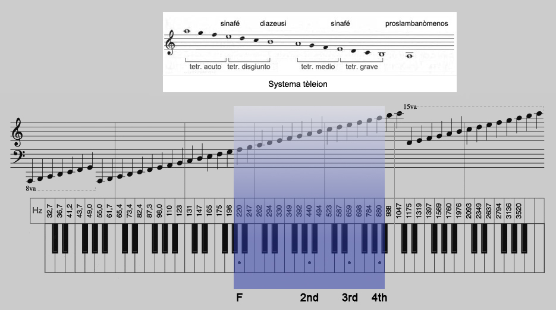

_Fig. 12.4 Sistema Tèleion e analisi armonica del teatro di Epidauro._

Il _tèleion_ era un “sistema”, e come tale non era sempre riferito ad una notazione o ad un’altezza specifica ma poteva essere trasportato a seconda delle esigenze vocali e musicali richieste. Per questa ragione è lecito supporre che l’eventuale ”accordatura” del teatro di Epidauro non sia stata ipotizzata per il rinforzo della voce maschile (come qualche autore sostiene) ma sia il frutto di una progettualità atta a determinare una sorta di relazione armonica complessiva _acustica, architettonica e musicale_ scaturita dalle conoscenze matematiche e musicali del tempo. Comunque sia, è interessante rilevare che i rapporti del _tèleion_ trovano una singolare corrispondenza con quanto visto nell’analisi armonica del Teatro di Epidauro.

##### ADDENDA[^9]

Quanto esposto in questo capitolo, fu anticipato dall'autore in questo video cui ho avuto la ventura di collaborare e che pubblicammo su YouTube nel 2013.

<iframe width="560" height="315" src="https://www.youtube-nocookie.com/embed/UcZiwyFiLsI?start=1" title="YouTube video player" frameborder="0" allow="accelerometer; autoplay; clipboard-write; encrypted-media; gyroscope; picture-in-picture" allowfullscreen></iframe>

[^1]: L. Cremer, _Different Distributions of the Audience in Auditorium Acoustics_.
[^2]: N. Barkas, N. Vardaxis, _Current operation of the ancient Greek theatres: The problem of environmental noise. The Acoustics of Ancient Theatres Conference_.
[^3]: N. F. Declercq, C. S. A. Dekeyser, _Acoustic diffraction effects at the Hellenistic amphitheatre of Epidaurus: Seat rows responsible for the marvellous acoustics_.
[^4]: T. Lokki, A. Southern, S. Siltanen, L. Savioja, _Studies of Epidaurus with a hybrid room acoustics modelling method. The Acoustics of Ancient Theatres Conference_.
[^5]: A. Farnetani, N. Prodi, R. Pompoli, _Measurements of sound scattering of the steps of the cavea in ancient open air theatres. Proceedings of the International Symposium on Room Acoustics_.
[^6]: N. F. Declercq, C. S. A. Dekeyser, _Acoustic diffraction effects at the Hellenistic amphitheater of Epidaurus: Seat rows responsible for the marvelous acoustics_.
[^7]: D. Lubman, _Archaeological acoustic study of chirped echo from the Mayan pyramid at Chichen Itza, in the Yucatan Region of Mexico... Is this the world's oldest known sound recording?_.
[^8]: G. Gasperini, _Enciclopedia Italiana Treccani_.
[^9]: NdC: questo paragrafo è stato aggiunto al testo originale.