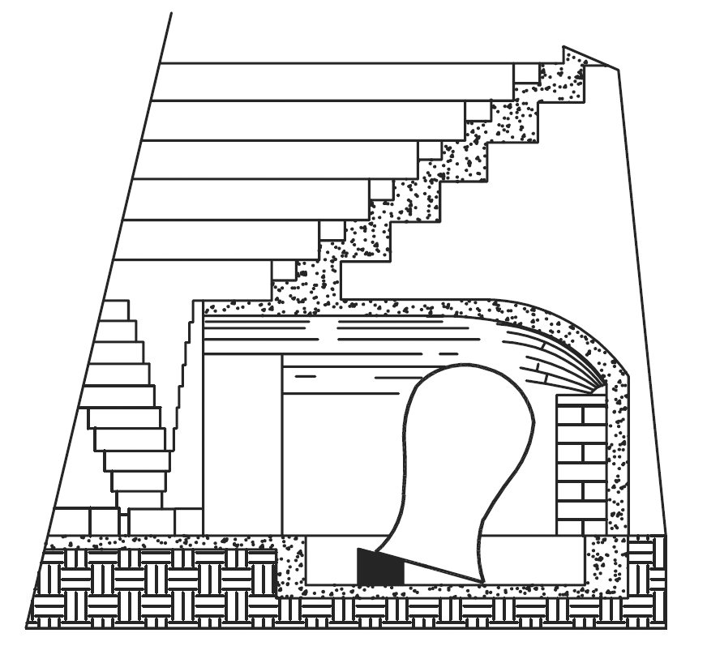

I _vasi risonanti_ o _echeia_, sono stati descritti dall’architetto romano Marco Vitruvio Pollione (80 a.C. circa - 15 a.C. circa) nel suo “De Architectura”, libro V capo III, _Del Teatro, e della sua situazione_.

In questo libro, scritto probabilmente tra il 29 e il 23 a.C., Vitruvio descrive una serie di regole da seguire per la progettazione acustica dei teatri romani le cui premesse sono:

“_Si deve anche provvedere diligentemente che il luogo non sia privo d'eco, ma che in esso la voce possa propagarsi all'intorno in modo udibilissimo. Questo risultato si otterrà invero, se il posto sarà stato scelto ove non vi sia ostacolo alla risonanza_”.

E ancora:

_“laonde, siccome accade nelle gradazioni delle onde, così ancora nella voce, se non vi abbia alcun intoppo che ne trattenga la prima, questa non disturba la seconda, né le altre successive: ma tutte senza rimbombo giungono egualmente all’orecchio de’ i vicini e de lontani”_.

Questo è un passo piuttosto controverso perché sembra contraddire il precedente e che non ci consente di comprendere in modo univoco ed immediato cosa intendesse esattamente Vitruvio; egli suggerisce “uno spazio ove la voce risuoni, ma senza rimbombo” che alcuni studiosi traducono come _sine resonantia_ (senza risonanza o rimbombo) ed altri come _sua resonantia_ (con risonanza propria).

L’interpretazione _sine resonantia_ è stata proposta da Carlo Amati ([1776](http://it.wikipedia.org/wiki/1776)- [1852](http://it.wikipedia.org/wiki/1852)) architetto e professore di Milano - tra l’altro figlio di Alessio, rinomato fabbricatore di organi - che ha curato la traduzione del _De Architectura_ che ho sotto mano.

Si tratta di un’interpretazione piuttosto controversa, ma condivisa da diversi studiosi, che motivano la presenza dei vasi unicamente per l’assorbimento di specifiche frequenze che producono riflessioni ritenute dannose[^1].

Tuttavia, visto che più avanti Vitruvio ci descrive minuziosamente i vasi risonanti, è lecito dedurre che probabilmente intendesse uno spazio che avesse una certa quantità di riverbero e quindi di riflessioni sonore _“vi risuoni all’intorno”_ ma senza aloni eccessivi (formazioni di eco); interpretazione plausibile perché più avanti raccomanda:

“[…] _cosicché non odansi dall’orecchio le parole duplicate”,_ […] _“un luogo ove non resti impedito il rimbombo”_.

[…] Le onde sonore “_si diffondono, purché non vengano rattenute da qualche intoppo, o dalla strettezza del luogo, che lor non lasci terminare l’ondeggiamento._ […] _Formate poscia le Celle fra i sedili del teatro , vi si debbono disporre a tenore delle regole musiche, ed in maniera che non tocchino in alcuna parete, e vi rimanga intorno, e per di sopra, dello spazio vuoto_ […] _così con tal espediente la voce partendo dalla scena, come dal suo centro, si spande intorno, e percuotendo la cavità di ciaschedun vaso, produrrà un suono crescente in chiarezza, ed una conveniente armonica consonanza” […] “ogni anno vengon costruiti a Roma numerosi teatri senza rispetto di tali regole, ma in questo caso non si tiene conto del fatto che tutti i teatri pubblici in legno hanno vari piani di tavolati che favoriscono la propagazione del suono. Si deve invece ricorrere al sistema dei vasi risonatori di bronzo quando i teatri son costruiti con materiali solidi, in muratura, in pietra o in marmo, che per loro natura non risuonano”._

Secondo Vitruvio, i greci dell’antichità riconoscevano l’insufficienza della potenza acustica della voce degli attori nei teatri di grandi dimensioni:

“_Ciò si può anche ravvisare quando i citaredi vogliono cantare su i toni acuti, i quali rivolgonsi verso le porte della scena, cosicché coll’ajuto delle medesime assicurano la risonanza della loro voce”._

L’approccio teorico vitruviano per la progettazione dei vasi, attinge a piene mani dal “_Trattato dell’armonia_” di Aristosseno da Taranto (364-304 a.C.). Pitagorico prima e poi rilevante allievo di Aristotele, Aristosseno fu autore del più antico documento pervenuto ai posteri riguardo la teoria musicale ponendosi in contrasto con i rigidi principi matematici dello stesso Pitagora.

Dice ancora Vitruvio: “_così coll’Armonica_ (le leggi dell’armonia) _sono stati ritrovati dagli antichi i mezzi sicuri per accrescere la voce ne’ teatri”._

Dunque, se parliamo di “_accrescere la voce ne’ teatri_”, abbiamo la certezza che Vitruvio intendesse dei risonatori in grado di re-immettere energia sonora nel teatro.

“_La parola "consonanza", nel senso usato da Vitruvio, corrisponde al concetto attuale che la sovrapposizione del suono diretto con lo stesso suono un poco ritardato (riflessione) non produce confusione ma è percepito come un evento unico di intensità maggiore di quella del solo suono diretto”_[^2].

Queste _risonanze_ erano ottenute distribuendo con regolarità un grande numero di vasi di bronzo (ma anche di rame o di terracotta) di diverse dimensioni aventi la funzione di risonatori acustici secondo il noto principio delle cavità risonanti (risonatori di _Helmholtz_) da collocarsi in apposite nicchie realizzate nei gradini della cavea del teatro. La figura 1.5 riporta l’ipotetica ricostruzione e collocazione dei vasi risonanti del teatro di Beit She'an in Israele effettuata dallo studioso George Charles Izenour[^3].

_Fig. 1.5 Vasi risonanti secondo Izenour, 1977_

Tuttavia i vasi risonanti descritti da Vitruvio nel capitolo sul teatro romano hanno dato luogo a molte congetture, sia sulla loro reale esistenza e diffusione, sia sulla loro efficacia acustica.

Non dimentichiamoci che Vitruvio è stato un grande teorico dell’architettura ma che non ha mai costruito nulla, ad eccezione della Basilica di Fano, cittadina che dista una decina di chilometri dal luogo dal quale sto scrivendo, la cui attribuzione _vitruviana_ è comunque ancora dibattuta.

Certamente conosceva i teatri greci, quelli delle province romane e soprattutto quello di Pompeo, il primo teatro in pietra edificato a Roma tra il [61](https://it.wikipedia.org/wiki/61_a.C.) e il [55 a.C](https://it.wikipedia.org/wiki/55_a.C.). che, secondo Carlo Amati, è stato il suo teatro di riferimento: “_evidentemente di questo non d'altri egli parla_”. Riguardo i vasi sonori invece, Vitruvio si limita ad informarci di averne avuto notizia da qualche scritto greco e da altre fonti storiche.

Lui stesso conosceva solo i vasi di bronzo del teatro di Corinto portati a Roma dal console Lucio Mummio dopo la caduta ed il saccheggio della città del [146 a.C.](https://it.wikipedia.org/wiki/146_a.C.), informandoci però della loro esistenza _in alcune contrade d’Italia ed in molte città della Grecia_.

Un’altra ipotesi circa la presenza dei vasi ci è fornita dal medico e naturalista [Onorio Belli](https://www.treccani.it/enciclopedia/onorio-belli) nella sua descrizione del teatro di Lyctus o Lyttos a Creta.

Secondo il Belli questo teatro (ora scomparso) conteneva tre file con 13 vasi acustici ciascuna, disposti secondo le regole vitruviane.

In effetti vasi di questo tipo sono stati rinvenuti in diverse località, come nei teatri di Nora in Sardegna, del citato Beit She'an in Israele e di Gerasa in Giordania.

Nel teatro di Aezani, in Turchia sono stati trovati vasi di bronzo inseriti in blocchi di marmo, mentre tracce di nicchie (che forse indicavano la collocazione dei vasi) e anfore, sono state trovate nel teatro presso Nemi, vicino a Roma e nel teatro di Gioiosa Ionica, in Calabria. Vasi di terracotta (dolium) sono stati rinvenuti nel teatro di Bourges in Francia e nel teatro di Ippona, in Algeria.

In ogni caso sappiamo che nella stragrande maggioranza dei teatri greci e romani i vasi risonanti non erano utilizzati, e per alcuni studiosi rimane il dubbio che la loro funzione acustica sia propriamente quella descritta da Vitruvio[^4].

##### FUNZIONE ACUSTICA

Dunque, se la presenza dei vasi risonanti in diversi teatri è ormai assodata, la loro reale funzione ha aperto un dibattito che dura da secoli!

Alcuni studiosi ritengono che fossero usati come risonatori fonoassorbenti per aumentare la chiarezza e l’intelligibilità della parola piuttosto che la forza del suono.

In tal caso è lecito chiedersi perché usare vasi di bronzo, molto pesanti e certamente non economici visto che erano considerati un prezioso bottino di guerra; se la loro funzione era quella di assorbire determinate frequenze (o bande di frequenze) si potevano benissimo realizzare in terracotta, e in tal caso Vitruvio non avrebbe certo dimenticato di svelarci cosa ci fosse dentro: cenere, sabbia, terra, ecc. per “sintonizzare” la frequenza e/o il fattore di merito (Q) del risonatore.

Molti altri, ed io tra questi, ritengono invece che probabilmente i vasi fossero concepiti per aumentare la riverberazione e rafforzare la voce degli attori, come una sorta di moderna riverberazione artificiale o _assistita_ che ricorda in qualche modo le camere di riverberazione di alcune attuali sale da concerto. In tal caso sarebbe giustificato l’uso del bronzo, molto più adatto della terracotta perché più risonante.

In tutti i casi stiamo parlando di risonatori sintonizzati su specifiche frequenze che possono essere assorbite o re-irradiate in ambiente sulla base della loro costruzione e delle perdite energetiche interne che tali cavità producono.

Il dibattito è in corso e molti dubbi permangono, per questo non deve sorprendere la diffidenza degli archeologi nei confronti della reale funzione di questi vasi.

Allo stato delle nostre conoscenze la pragmatica chiave di lettura di [Wallace Clement Sabine](https://www.treccani.it/enciclopedia/wallace-clement-sabine) (1868 - 1919), considerato l’inventore dell’acustica moderna, appare forse quella più corretta quando scrive che le definizioni e le raccomandazioni di Vitruvio non sono facili da decifrare ma costituiscono “_un’analisi ammirevole del problema dell’acustica dei teatri Per renderle comprensibili nei termini della nomenclatura moderna bisogna sostituire la parola interferenza a dissonanza; la parola riverberazione a circumsonanza ed eco a risonanza”_[^5].

##### EFFICACIA ACUSTICA

Già nel 1700 lo studioso spagnolo [Ortiz y Sanz](https://es.wikipedia.org/wiki/Joseph_Ortiz_y_Sanz) (1739 – 1822), tra l’altro traduttore e commentatore dell’opera vitruviana, sosteneva che questi _meccanismi_ non potevano in alcun modo aiutare l’acustica dei teatri romani[^6].

In tempi più recenti, molti ricercatori si sono adoperati per ricostruire le condizioni acustiche del passato mediante approfondite misure in situ, modelli in scala e modelli matematici di simulazione, analizzando i vari aspetti che concorrono alla resa acustica di questi antichi edifici.

E, almeno per quanto riguarda i vasi risonanti, le risultanze degli studi mostrano una risposta condivisa che afferma la scarsa utilità pratica di questi dispositivi che, nella migliore delle ipotesi, fornivano un limitato contributo a livello locale, ovvero in prossimità degli spettatori più vicini ad essi.

Possiamo ragionevolmente dedurre che i vasi risonanti siano stati il frutto di un’interessante sperimentazione acustica che però non ha prodotto i risultati attesi.

E questo potrebbe essere il motivo che ha determinato il loro abbandono nei teatri costruiti in seguito[^7].

[^1]: N. Haddad, T. Akasheh,  _Vitruvius and Ancient Theatres._
[^2]: C. Ianniello, _L’acustica degli auditorî: arte, scienza o mito? I tempi dei teatri greci e romani._
[^3]: G. C. Izenour, _Theater Design._
[^4]: A. Barba Sevillano, R. Lacatis, A. Giménez and J. Romero, _Acoustics vases in ancient theatres: disposition, analysis from the ancient tetracordal musical system._
[^5]: W. C. Sabine, _“Collected Papers on Acoustics, Theatre Acoustics”._
[^6]: J. Ortiz y Sans, _Los diez libros de architectura de M. Vitruvio Polión traducidos del latin y comentados por Joseph Ortiz y Sanz_.
[^7]: S. Polychronopoulos, D. Kougias, P. Polykarpou, D. Skarlatos, _The Use of Resonators in Ancient Greek Theatres_. 