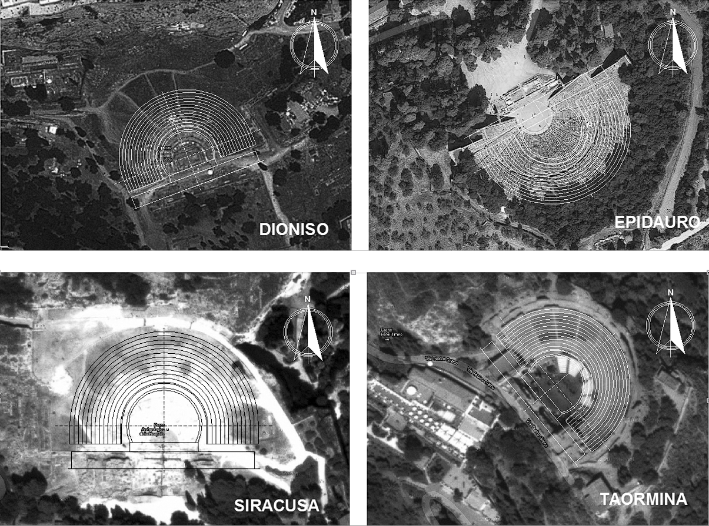

Un altro aspetto piuttosto controverso è quello dell’orientamento dei teatri rispetto alla direzione dei venti dominanti che avrebbero in qualche modo agevolato la propagazione del suono. Ma le considerazioni e soprattutto le misurazioni acustiche, danno conclusioni diverse da quelle degli studiosi del teatro antico: in numerosi teatri osservati il vento spira da varie direzioni, spesso verso il basso o attraverso la collina stessa e non solo verso l'alto. “_Non importa tanto la sua direzione quanto il fatto che esso contribuisce al turbamento ambientale già presente, essendo percepito come rumore di fondo che maschera la recitazione. Così il vento comporta più un impedimento che un aiuto qualunque sia la sua direzione_[^1]".

E ancora: “_in un teatro Romano una brezza moderata ha causato una riduzione del grado di intelligibilità della parola del 40%_[^2]”.

L’ipotesi delle brezze che _portano e aiutano il suono_ pare quindi non confortata da alcuna certezza; invero sappiamo che i teatri erano solitamente orientati secondo la morfologia del territorio avendo cura di evitare l’abbagliamento del sole per gli spettatori. Per far questo e per illuminare adeguatamente la scena, la cosa più logica sarebbe stata quella di costruire il teatro con la cavea orientata a Est o Nord-Est, ma anche questa regola non è stata sempre applicata. Va da sé che una peculiarità dei teatri greci era anche la valorizzazione della visione panoramica e su questo punto Taormina si spiega da sola: ottimo orientamento e strepitosa vista sull’Etna e sul mare!

_Fig. 1.7 Orientamento di alcuni teatri greci_

[^1]: G. C. Izenour, _Theater Design_.
[^2]: S. R. Shankland, _Acoustics of Greek Theatres_.